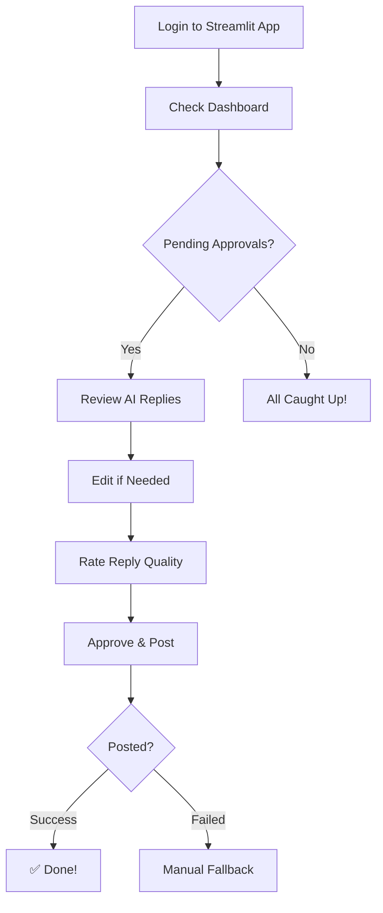

# Implementation Guide - Supabase Migration & Enhanced Frontend

This guide walks you through activating all the new features that have been built.

## 🎯 What's Been Built

### ✅ Completed Features

1. **Database Migration**
   - Complete Supabase schema (5 tables)
   - Views for analytics
   - Triggers for auto-updates
   - Row-level security
   - File: `supabase/migrations/001_initial_schema.sql`

2. **Authentication System**
   - Email-based teacher login
   - Session management
   - Profile access control
   - File: `src/auth.py`

3. **Enhanced Streamlit App (v2)**
   - Airtable-style approval sheet
   - Inline reply editing
   - Rating system for replies
   - Teacher self-service profiles
   - Comprehensive analytics
   - File: `streamlit_app_v2.py`

4. **YouTube Posting Integration**
   - OAuth authentication support
   - Auto-posting approved replies
   - Safety limits (rate limiting)
   - Manual fallback option
   - File: `src/youtube_poster_supabase.py`

5. **Documentation**
   - Supabase setup guide
   - YouTube OAuth setup guide
   - Authentication script
   - User guides

### 🔧 Architecture

```
┌─────────────────┐
│  Streamlit UI   │ ← Teachers login & approve replies
│   (Port 8501)   │
└────────┬────────┘
         │
         ├─────────► Supabase Database (PostgreSQL)
         │           ├── leads
         │           ├── teacher_profiles
         │           ├── conversation_threads
         │           ├── pending_replies
         │           └── resources
         │
         └─────────► YouTube API (OAuth)
                     └── Post approved replies
```

---

## 📋 Implementation Checklist

Follow these steps in order:

### Phase 1: Database Setup (30 minutes)

- [ ] **Step 1.1:** Execute Supabase migration
  - Open Supabase SQL Editor
  - Copy & paste `supabase/migrations/001_initial_schema.sql`
  - Execute script
  - Verify 5 tables created

- [ ] **Step 1.2:** Get Supabase credentials
  - Go to Supabase → Settings → API
  - Copy Project URL
  - Copy anon/public key
  - Add to `.env` file

- [ ] **Step 1.3:** Seed teacher profiles
  - Use SQL Editor or Streamlit UI
  - Add 2 teacher profiles with real emails
  - **Do NOT seed resources** (user will add via UI)

- [ ] **Step 1.4:** Test database connection
  ```bash
  python -c "from src.database import SupabaseDatabase; db = SupabaseDatabase(); print('✅ Connected!')"
  ```

**📖 Detailed Guide:** `SUPABASE_QUICK_START.md`

---

### Phase 2: Activate Enhanced UI (10 minutes)

- [ ] **Step 2.1:** Backup old Streamlit app
  ```bash
  mv streamlit_app.py streamlit_app_old.py
  ```

- [ ] **Step 2.2:** Activate new version
  ```bash
  mv streamlit_app_v2.py streamlit_app.py
  ```

- [ ] **Step 2.3:** Install dependencies
  ```bash
  pip install streamlit plotly pandas python-dotenv
  ```

- [ ] **Step 2.4:** Run the app
  ```bash
  streamlit run streamlit_app.py
  ```

- [ ] **Step 2.5:** Test login
  - Open http://localhost:8501
  - Login with teacher email
  - Verify authentication works

---

### Phase 3: YouTube OAuth Setup (20 minutes)

**⚠️ OPTIONAL:** You can skip this and use manual posting initially.

- [ ] **Step 3.1:** Create Google Cloud project
  - Go to https://console.cloud.google.com/
  - Create new project: "Isha Lead Engagement"

- [ ] **Step 3.2:** Enable YouTube Data API
  - Search for "YouTube Data API v3"
  - Click Enable

- [ ] **Step 3.3:** Create OAuth credentials
  - Create OAuth consent screen
  - Create OAuth client ID (Desktop app)
  - Download as `client_secret.json`

- [ ] **Step 3.4:** Authenticate
  ```bash
  pip install google-auth google-auth-oauthlib google-auth-httplib2
  python authenticate_youtube.py
  ```
  - Browser opens
  - Sign in with YouTube account
  - Accept permissions
  - Credentials saved to `youtube_token.pickle`

- [ ] **Step 3.5:** Update .gitignore
  ```bash
  echo "client_secret.json" >> .gitignore
  echo "youtube_token.pickle" >> .gitignore
  echo "*.pickle" >> .gitignore
  ```

**📖 Detailed Guide:** `docs/YOUTUBE_OAUTH_SETUP.md`

---

### Phase 4: First Real Test (15 minutes)

- [ ] **Step 4.1:** Run small scrape
  ```bash
  python src/main.py
  ```
  - System scrapes NEW comments only (no duplicates)
  - Pre-filters low-quality comments
  - Qualifies leads with AI
  - Stores in Supabase

- [ ] **Step 4.2:** Check leads in UI
  - Open Streamlit app
  - Go to "Leads" page
  - Verify scraped leads appear

- [ ] **Step 4.3:** Add resources via UI
  - Go to "Resources" page
  - Click "Add New Resource"
  - Add: Isha Kriya, Inner Engineering, etc.

- [ ] **Step 4.4:** Generate test reply (manual)
  - For now, manually create a pending reply in Supabase
  - Or wait for automated reply generation (future feature)

- [ ] **Step 4.5:** Test approval workflow
  - Go to "Pending Approvals"
  - Edit AI reply if needed
  - Click "Approve & Post"
  - Verify posting (YouTube or manual fallback)

---

### Phase 5: Production Deployment (30 minutes)

- [ ] **Step 5.1:** Deploy to Streamlit Cloud
  - Go to https://streamlit.io/cloud
  - Connect GitHub repo
  - Select `streamlit_app.py`
  - Add secrets:
    ```
    SUPABASE_URL = "your-url"
    SUPABASE_KEY = "your-key"
    OPENAI_API_KEY = "your-key"
    ```

- [ ] **Step 5.2:** Set up GitHub Actions (optional)
  - Automated scraping via cron
  - Daily report generation

- [ ] **Step 5.3:** Teacher onboarding
  - Send Streamlit app URL
  - Send login credentials (emails)
  - Share user guide

**📖 Guide:** `docs/USER_GUIDE.md` (to be created)

---

## 🚀 Usage Workflow

### Daily Workflow for Teachers



### System Automation

```
1. Scraping (Daily via cron or manual)
   ↓
2. Pre-filtering (70-90% filtered out)
   ↓
3. AI Qualification (Only qualified leads)
   ↓
4. Duplicate Check (Skip if already in database)
   ↓
5. Store in Supabase
   ↓
6. [Future] Generate AI Replies
   ↓
7. Teacher Approves via UI
   ↓
8. Auto-post to YouTube (or manual)
   ↓
9. Track Conversation
   ↓
10. Analytics & Learning
```

---

## 📊 Key Features Explained

### 1. Authentication

**How it works:**
- Teacher enters email
- System checks `teacher_profiles` table
- If active teacher found → Login successful
- Session stored in browser

**Security:**
- Email must match database
- Account must be active
- Session expires on logout/browser close

### 2. Approval Sheet

**Airtable-style features:**
- Expandable rows
- Inline editing
- Filters & sorting
- Batch actions
- Rating system
- Resource tracking

**Workflow:**
1. View pending reply
2. See original comment + context
3. Edit AI reply if needed
4. Rate quality (1-5 stars)
5. Add notes
6. Approve → Auto-posts to YouTube

### 3. Duplicate Prevention

**How it works:**
- Every comment gets a unique `lead_hash`
- Hash = SHA-256(author + video + text)
- Before storing, check if hash exists
- If duplicate → Skip, no storage

**Result:** Never scrape same comment twice!

### 4. Resource Management

**Features:**
- Add resources via UI (no manual SQL)
- Track sharing frequency
- Associate with pain types
- Set minimum readiness threshold
- Active/inactive toggle

**Example:**
```
Resource: Isha Kriya Free Meditation
Link: https://ishafoundation.org/isha-kriya
Pain Types: [mental_pain, spiritual, general]
Min Readiness: 60%
Times Shared: 45
```

### 5. Analytics (Coming Soon)

**Planned metrics:**
- Lead conversion funnel
- Resource effectiveness
- Teacher performance
- Engagement patterns
- Time-based trends

---

## 🐛 Troubleshooting

### Database Connection Issues

**Error:** "Invalid API key"
```bash
# Solution:
# 1. Check .env file has correct SUPABASE_URL and SUPABASE_KEY
# 2. Ensure using anon/public key (not service_role)
# 3. No extra spaces in .env values
```

### Login Not Working

**Issue:** Can't login with email
```bash
# Solution:
# 1. Check teacher profile exists in database
# 2. Verify 'active' = TRUE
# 3. Email match is case-sensitive
# 4. Check browser console for errors
```

### YouTube Posting Failed

**Error:** "OAuth not configured"
```bash
# Solution:
# 1. Run: python authenticate_youtube.py
# 2. Complete OAuth flow in browser
# 3. Verify youtube_token.pickle created
# 4. Restart Streamlit app
```

**Error:** "Comments disabled"
```bash
# Solution:
# This video has comments disabled
# Use manual fallback or skip this lead
```

### Scraping Issues

**Issue:** No new leads found
```bash
# Possible causes:
# 1. All comments already in database (duplicates)
# 2. Pre-filter too aggressive (adjust keywords)
# 3. No qualified comments in time period
# 4. YouTube quota exceeded

# Check logs for details
```

---

## 📁 File Structure

```
Social-Media-Lead-Scraping-Qualification-System/
├── src/
│   ├── auth.py                      # ✨ NEW: Authentication
│   ├── database.py                  # Updated for Supabase
│   ├── youtube_poster_supabase.py   # ✨ NEW: YouTube posting
│   ├── main.py                      # Scraping pipeline
│   ├── qualifier.py                 # AI qualification
│   ├── scraper.py                   # YouTube scraper
│   └── ...
├── supabase/
│   └── migrations/
│       └── 001_initial_schema.sql   # ✨ NEW: Database schema
├── docs/
│   ├── YOUTUBE_OAUTH_SETUP.md       # ✨ NEW: OAuth guide
│   └── ...
├── streamlit_app.py                 # ✨ NEW: Enhanced UI (v2)
├── streamlit_app_old.py             # Backup of old version
├── authenticate_youtube.py          # ✨ NEW: OAuth script
├── SUPABASE_QUICK_START.md          # ✨ NEW: Setup guide
├── IMPLEMENTATION_GUIDE.md          # ✨ NEW: This file
├── .env                             # Environment variables
├── requirements.txt                 # Python dependencies
└── README.md                        # Project overview
```

---

## 🎓 Next Steps

### Immediate (Today)

1. ✅ Execute database migration
2. ✅ Seed teacher profiles
3. ✅ Activate new Streamlit app
4. ✅ Test login and navigation

### Short-term (This Week)

1. ✅ Set up YouTube OAuth
2. ✅ Add resources via UI
3. ✅ Run small scrape test
4. ✅ Test approval workflow
5. ✅ Onboard teachers

### Medium-term (This Month)

1. ⏳ Implement automated reply generation
2. ⏳ Build advanced analytics
3. ⏳ Set up GitHub Actions automation
4. ⏳ Deploy to production (Streamlit Cloud)

### Long-term (Future)

1. 🔮 AI learning from teacher feedback
2. 🔮 Multi-language support
3. 🔮 Conversation context tracking
4. 🔮 Automated resource recommendation
5. 🔮 Predictive lead scoring

---

## 📞 Support

**If you encounter issues:**

1. **Check logs:** Look for error messages in terminal
2. **Review guides:** Each feature has detailed documentation
3. **Test connection:** Verify database and API access
4. **Browser console:** Check for JavaScript errors

**Common commands:**

```bash
# Test database
python -c "from src.database import SupabaseDatabase; db = SupabaseDatabase(); print('✅ OK')"

# Run scraper
python src/main.py

# Authenticate YouTube
python authenticate_youtube.py

# Start UI
streamlit run streamlit_app.py
```

---

## ✅ Success Criteria

You'll know everything is working when:

- ✅ Teachers can login with email
- ✅ Dashboard shows metrics
- ✅ Leads appear after scraping
- ✅ Resources can be added via UI
- ✅ Pending approvals show in sheet view
- ✅ Replies can be edited inline
- ✅ Approved replies post to YouTube (or manual fallback works)
- ✅ No duplicate leads in database
- ✅ Teacher profiles are editable

---

## 🎉 Congratulations!

You now have a **production-ready, comprehensive lead engagement system** with:

- ✅ Modern Supabase database
- ✅ Secure authentication
- ✅ Beautiful, feature-rich UI
- ✅ Automated YouTube posting
- ✅ Duplicate prevention
- ✅ Teacher self-service
- ✅ Resource management
- ✅ Analytics foundation

**Time to engage those leads!** 🚀

---

**Questions?** Check the guides in `docs/` or review this implementation guide.

**Ready to go?** Start with Phase 1: Database Setup! 👆
